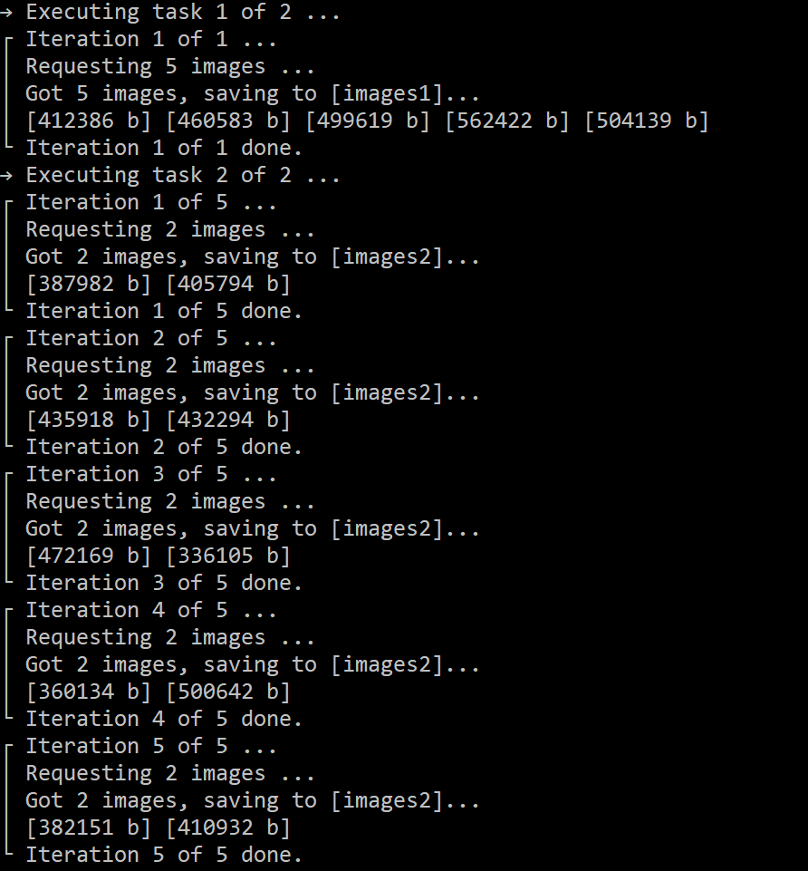

# StableDiffusionAPIPHP
A simple skeleton code for Stable Diffusion API usage with pure PHP (no extra libraries needed)

**Usage:**
1. Make sure you run https://github.com/AUTOMATIC1111/stable-diffusion-webui with "set COMMANDLINE_ARGS=--api" option.
2. Check $url variable in run.php, make sure ip and port are correct.
3. Put your data in run.csv or directly in run.php.
4. Just run "php run.php run.csv" or "php run.php INTERNAL_CONFIG".

**Expected behavior:**

